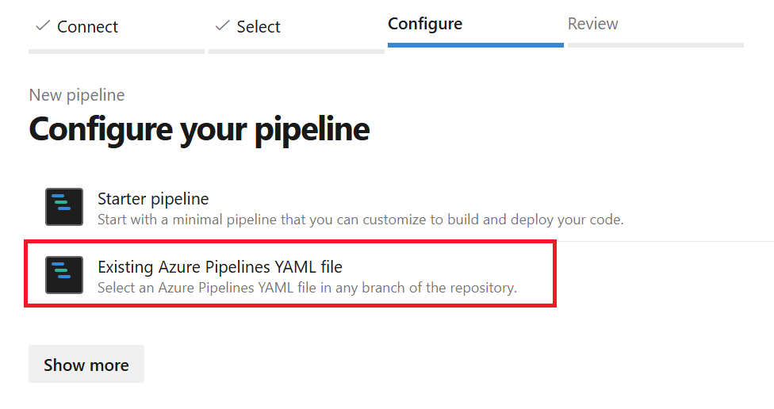

# 🔨 Hands-on: Reuse your pipelines

In this hands on lab, you will see how to reuse your pipelines accross different project.

## Create a pipeline template repository

First thing first, let's create a new repository to store our pipeline templates. Call it `AdoPipelineTemplates`.


Create a new file inside a folder called `templates` and name it `dotnet-build.yml`.


This file will contain a template to simulate the build of a dotnet pipeline.

Next, create a reusable templates with 3 steps that will simulate the build of a dotnet project.
This template will have 2 parameters:
- `dotnetVersion`: the version of dotnet to use with a default value of `8.0`
- `projectPath`: the path to the project to build with no default value

and 3 steps:
- One to restore the project
- One to run unit test on the project
- One to build the project

all those steps will be a script command with an echo message and a sleep for few seconds.

Finally try to display the parameters in the pipeline.

<details>
<summary>Solution</summary>

```YAML
parameters:
  - name: dotnetVersion
    type: string
    default: '8.0'
  - name: projectPath
    type: string

steps:
- script: |
    echo "🚀 Restore Nuget packages... from ${{ parameters.projectPath }}"
    sleep 1
  displayName: 'Restore the project'

- script: |
    echo "🚀 Run Unit Tests..."
    sleep 3
  displayName: 'Run Unit Tests on the project'

- script: |
    echo "🔨 Build the project using ${{ parameters.dotnetVersion }}"
    sleep 3
  displayName: 'Build the project'
```
</details>

When ready, commit your changes.

Go to the **Tags** section of your repository and create a new tag called `v1.0` with a little description.


You will use this tag to reference the version of your template. This will allow you to easily reference a specific version of your template in your pipelines. Each project referencing this template will be able to choose the version of the template to use.

## Consuming the pipeline template

Now that you have your pipeline template, let's create a new pipeline in the same repository as the one you created in the previous lab.

Create a new file called `consume-template-azure-pipelines.yml`:


Create a pipeline that will use the template you created in the previous step inside a job called `Build`. Add a step after the template to simulate another step in the pipeline.

<details>
<summary>Solution</summary>

```YAML
trigger: none

resources:
  repositories:
    - repository: templates
      type: git
      name: AdoPipelineTemplates
      ref: 'refs/tags/v1.0'

jobs:
  - job:
    displayName: Build
    pool:
      vmImage: 'ubuntu-latest'
    steps:
        - template: templates/dotnet-build.yml@templates
          parameters:
              projectPath: './src/my-path'

        - script: |
            echo "Specific task"
            sleep 4
          displayName: 'Specific task'
```

You use the `resources` section to reference the repository containing the template. You specify the tag `v1.0` to reference the version of the template you want to use.

</details>

Go to the **Pipelines** section and click **New pipeline**, then select **Azure Repos Git** and select the repository you are working on.

This time select the **Existing Azure Pipelines YAML file** and select the file you just created.



Select the `consume-template-azure-pipelines.yml` file and click on **Continue**.


Then click on **Run** to run the pipeline.

When the pipeline is finished, you should see the output of the template and the specific task:


## Summary

In this hands-on lab, you learned how to create a pipeline template and consume it in another pipeline. This allows you to reuse your pipeline logic across different projects.